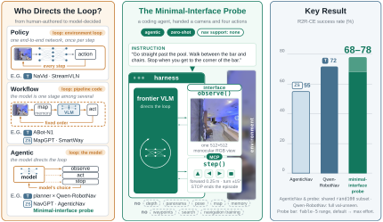

# MIP — the Minimal-Interface Probe

The official re-implementation of **Embodied Agents Take Control: Minimal-Interface Zero-Shot
Agents Rival Industrial-Scale Policies in Vision-and-Language Navigation**
([arXiv:2607.26148](https://arxiv.org/abs/2607.26148)).

<p align="center">
  
</p>

A general-purpose coding agent (Claude Code, Codex CLI or mini-SWE-agent) is put in front of a
simulator through **two tools**, `observe()` and `step()`, with a monocular RGB camera and a
handful of discrete actions. No map, no memory module, no waypoint predictor, no search, no
navigation training. The reasoning model directs every action itself — the paper calls this
organization *agentic embodied control* — and is scored on R2R-CE, RxR-CE, VLNVerse and HM-EQA
exactly as the trained systems are.

## Status

The code the paper's numbers were produced with lives in AgentCanvas, on the branch
[`archive/mip-embodied-agents-take-control`](https://github.com/Embodied-Agent-Squad/AgentCanvas/tree/archive/mip-embodied-agents-take-control)
(its `coding-agent/` directory). That branch is frozen as the record. This repository is the
**official re-implementation** of the same experiment: the same protocol, briefing, tools, splits
and metrics, on cleaner code with explicit semantic layers — the runner, the arm (briefing + tool
surface), the environment served in its own process, and the environment package underneath — and
on [EmbodiedScore](https://github.com/Embodied-Agent-Squad/EmbodiedScore-envs), the standard
library that owns the episodes, bodies and metrics.

EmbodiedScore is still under development. We will do our best to keep the benchmarks the paper
uses — R2R-CE, RxR-CE, VLNVerse and HM-EQA — working here at all times; other lines of the
package may move.

| what | where |
|---|---|
| the runner, the three harnesses, the bare arm, the paper's cells | this repository |
| environments, episodes, bodies, metrics | [EmbodiedScore-envs](https://github.com/Embodied-Agent-Squad/EmbodiedScore-envs) (pip dependency) |
| the simulator, habitat-sim 0.3.3, shipped as manylinux wheels | [EmbodiedScore-habitat](https://github.com/Embodied-Agent-Squad/EmbodiedScore-habitat) (pip dependency) |
| install: one interpreter, `pip install -r requirements.txt`, link the data, three checks | [INSTALL.md](INSTALL.md) |

## Headline numbers

R2R-CE `rand100` (a 100-episode val-unseen sample shared with AgenticNav / OpenNav / SmartWay),
success rate in %, SPL in %. Default reasoning effort unless stated; `±` is the standard deviation
over three replicated runs.

| harness | model | SR | SPL |
|---|---|---:|---:|
| Claude Code (SDK) | opus-5 | 70.7 ± 3.5 | 55.21 |
| Claude Code (SDK) | fable-5 | 68.3 ± 1.5 | 58.02 |
| Claude Code (SDK) | opus-4.8 | 55.7 ± 2.3 | 47.31 |
| Claude Code (SDK) | sonnet-5 | 51.3 ± 1.2 | 37.84 |
| Codex CLI | gpt-5.6 (low) | 56 | 41.57 |
| Codex CLI | gpt-5.5 | 45 | 35.74 |
| mini-SWE-agent | fable-5 | 72 | 59.08 |
| mini-SWE-agent | gpt-5.6 | 60 | 42.04 |
| mini-SWE-agent | qwen3.6-plus | 45 | 33.27 |
| mini-SWE-agent | qwen3.5-4b (local) | 5 | 4.58 |
| Claude Code (SDK) | fable-5, **max effort** | **78** | 65.27 |

Same loop, unchanged, on the other benchmarks (fable-5, Claude Code, default effort): RxR-CE
`rand100` 26% SR, VLNVerse fine val-unseen 84% SR / 62.47 SPL,
HM-EQA `mip100` 76% accuracy. Model choice dominates the variation; harness differences are modest;
a forced waypoint tool helps weaker models and can hinder stronger ones (the waypoint and hybrid
arms are not in this repository, see [Reproducing the paper](#reproducing-the-paper)). All numbers
are the paper's; the tables are reproduced line by line in
[`scripts/mip_paper_cells.sh`](scripts/mip_paper_cells.sh).

## What the agent gets, and what it never sees

The briefing (`exp_workspace/bareES/prompts.py`, one frozen text) tells the model it is driving a
robot in a real indoor environment through two tools:

```
observe()        the forward-facing camera: one 512×512 RGB frame, HFOV 90°
step(actions)    a list of moves, executed in order:
                 0 = STOP (ends the episode)   1 = forward 0.25 m
                 2 = turn left 15°             3 = turn right 15°
                 4 = tilt camera up 30°        5 = tilt camera down 30°
```

The protocol is frozen per cell and identical across harnesses and models:

| knob | value |
|---|---|
| episodes | R2R-CE `rand100` val-unseen sample, indices 0–99 (RxR-CE `rand100`, VLNVerse fine val-unseen, HM-EQA `mip100`) |
| observation | 512×512 RGB, HFOV 90°, monocular, no depth, no panorama, no pose |
| LLM-call limit | 200 per episode |
| action budget | 500 low-level simulator steps (Habitat's episode-step cap) |
| episode timeout | 2400 s |
| session | one fresh harness session per episode; nothing survives between episodes |
| effort | the vendor's word (`default` sends nothing): Claude low · medium · high · max, OpenAI low · medium · high · xhigh |

The model never sees a score: success, SPL, nDTW, distance to goal and path length are computed
by the environment package from the simulator state after every step and written to the run
directory only. Auto-observe is off: the model calls `observe()` when it wants to look.

## Run

One yaml is one experiment (`exp_workspace/bareES/configs/std_<task>_es_bareES.yaml`): task,
environment, agent and run are written out in full, and only the **seat** is chosen on the
command line — `harness=` · `model=` · `effort=`. The run name is the cell's identity:
`std_<task>_es_<harness>_<model>_<effort>_bareES`.

```
python runner.py std_r2r_es_bareES harness=cc model=fable-5 +run.fake=true run.episodes=0   # wiring check: scripted agent, no tokens
python runner.py std_r2r_es_bareES harness=cc model=fable-5 api=fake run.episodes=0        # the real CLI on a scripted endpoint, no model
python runner.py std_r2r_es_bareES harness=cc model=fable-5 run.episodes=0-9               # a probe: ten episodes
python runner.py std_r2r_es_bareES harness=cc model=fable-5                                 # the board cell
python runner.py std_r2r_es_bareES harness=cc model=fable-5 effort=max                      # the same seat at max effort
python runner.py std_r2r_es_bareES harness=codex model=gpt-5.6 effort=low                   # Codex CLI
python runner.py std_r2r_es_bareES harness=mini model=qwen3.6-plus                          # mini-SWE-agent
python runner.py std_r2r_es_bareES harness=cc model=fable-5 run.episodes=3,7 run.resume=true  # rerun two episodes into the same run
python runner.py std_r2r_es_bareES harness=cc model=fable-5 +run.workers=10                 # ten simulator servers, ten episodes at a time
python -m ui.server                                                                         # a read-only page over outputs/
```

**Seats.** A model file row without an entry for a harness means that seat does not exist
(`exp_workspace/bareES/configs/models/models.yaml`):

| harness | `harness=` | models (`model=`) | auth |
|---|---|---|---|
| Claude Code, via the Claude Agent SDK | `cc` | fable-5 · opus-5 · opus-4.8 · sonnet-5 | `claude` login (subscription); a stray `ANTHROPIC_API_KEY` is stripped so sessions never bill via API (`CODING_AGENT_ALLOW_API_KEY=1` opts in) |
| Codex CLI | `codex` | gpt-5.6 · gpt-5.5 · gpt-6 | `codex login` (subscription) |
| mini-SWE-agent (litellm) | `mini` | fable-5 · opus-5 · opus-4.8 · sonnet-5 · gpt-5.6 · gpt-5.5 · qwen3.5-plus · qwen3.6-plus · qwen3.7-plus · qwen3.5-4b · qwen3.5-9b | the provider's key in the shell: `ANTHROPIC_API_KEY` · `OPENAI_API_KEY` · `DASHSCOPE_API_KEY` · `OLLAMA_URL` (the 4b / 9b rows run locally) |

**Cells, not flags.** Changing any value in a yaml is a different experiment: copy the file and
rename it, never edit in place. A run over a subset of episodes is named `test_…` and stays off the
board; `run.resume=true` fills missing episodes of an existing run. `+run.fake=true` swaps the
harness for a scripted one (no CLI, no tokens; lands under `outputs/fake/`); `api=fake` keeps the
real harness and points it at a scripted endpoint that plays the same walk (lands under the
harness's own root as `fakeapi_…`).

**Every run writes**, under `outputs/<harness dir>/<run name>/`:

```
summary.json        per-episode records + aggregate metrics + cost + the list of every writer
episode_<i>.jsonl   the episode as events: prompts, tool calls, moves, metrics after each step
raw/                the harness's own stream, untouched
live_<i>/           every frame the model looked at
code_<ts>/          a snapshot of the code that produced the run (no snapshot, no run)
stats.html          per-run statistics (steps, time, calls, tokens, cost)
env_server.log      the simulator process
```

Cost is one formula for every harness: the provider's reported tokens × litellm's list price;
the harness's own figure is kept beside it as a cross-check.

## Reproducing the paper

[`scripts/mip_paper_cells.sh`](scripts/mip_paper_cells.sh) lists, table by table, the runner
line of every cell in the paper and, in its second half, the paper's number for each. It is a
reference to copy from, not a program (its first line exits).

| paper | cells | here |
|---|---|---|
| Table 2, the main board | R2R-CE, 17 seats at default effort | `std_r2r_es_bareES` × the seats above |
| Table 3 + appendix, effort | Claude at `max`, OpenAI at `xhigh` | `effort=max` / `effort=xhigh` |
| Table 4, interface | VLNVerse primitives (sonnet-5, fable-5) | `std_vlnverse_es_bareES` |
| Table 4, interface | R2R-CE / VLNVerse **waypoint** rows | not here (waypoint arm) |
| Table 5, hybrid | fable-5 primitives + waypoint tool | not here (hybrid arm) |
| Table 6, long horizon | R2R-CE / RxR-CE primitives | `std_r2r_es_bareES`, `std_rxr_es_bareES` |
| Appendix B | HM-EQA `mip100` | `std_hmeqa_es_bareES` |
| Table 1 Human row, Appendix D | a human tester, a Unitree Go2 | not here |

Two things to know before comparing numbers. The paper's runs were made on the archived
AgentCanvas branch (see [Status](#status)) over the same simulator, episodes and protocol; a cell
run here is a new measurement of the same cell on the re-implementation, not a replay of the
archived one. And `rand100` is a sample: the paper's tables put our rows beside
full val-unseen rows from the literature and say so in the captions.

## Repository layout

```
runner.py                 the entry point and the run loop: python runner.py <experiment> [k=v …]
core/                     the framework
  arm.py · episode.py     an arm (prompts + tools) and one episode's loop
  harnesses/              claude_sdk · codex_cli · mini_swe (+ mini/, its in-repo body) · fake (the scripted one)
  callbacks/              jsonl · raw · cost · snapshot · vram · stats — each declares what it writes
  api/                    the scripted endpoint behind api=fake (one loopback port, three wire formats)
  envserver / envclient   the simulator served as a verb object in its own process; the runner talks HTTP
  shapes/                 how each task family (nav, objnav, eqa, express, goat) is read off the environment
exp_workspace/bareES/     the minimal-interface arm, self-contained
  prompts.py              the briefing
  mcp/env.py              the world as a verb object over EmbodiedScore-envs
  mcp/bridge.py           observe / step as the model's MCP tools (frozen arm code, imports nothing of the repo)
  configs/                std_{r2r,rxr,vlnverse,hmeqa}_es_bareES.yaml · harness/{cc,codex,mini} · models/models.yaml · api/{native,fake}
splits/                   r2r/rand100 · rxr/rand100 · hmeqa/mip100 and their provenance (splits/README.md)
scripts/                  mip_paper_cells.sh
reporting/ · ui/          per-run statistics and the results page
tests/                    the framework's tests (no GPU, no data, no keys)
```

## Design rules

- **Provenance or no run.** A code snapshot is the one fatal callback: a run that cannot record
  the code that produced it does not start. Resuming on changed code writes a sibling snapshot.
- **The environment package owns the numbers.** Episodes, bodies, metrics and budgets come from
  EmbodiedScore-envs, transcribed from habitat-lab 0.1.7 / VLN-CE; nothing here hand-computes a
  success rate. nDTW is FastDTW as the boards computed it, bit for bit.
- **The bridge is the single tool surface.** All three harnesses call the same `mcp/bridge.py`;
  what differs between seats is the harness loop and the model, which is the point.
- **A parameter the harness cannot honour raises.** A silently dropped setting is a wrong cell.
- **Deviations are written down.** `exp_workspace/bareES/README.md` lists where a line departs
  from the package's rule (the standard action table on every line, HM-EQA on the standard body).

## Citation

```bibtex
@article{zhou2026mip,
  title   = {Embodied Agents Take Control: Minimal-Interface Zero-Shot Agents Rival Industrial-Scale Policies in Vision-and-Language Navigation},
  author  = {Zhou, Jian and Zhao, Xunyi and Zhou, Gengze and Li, Zerui and Lin, Sihao and Liu, Jiajun and Wu, Qi},
  journal = {arXiv preprint arXiv:2607.26148},
  year    = {2026}
}
```

Jian Zhou and Xunyi Zhao contributed equally.
